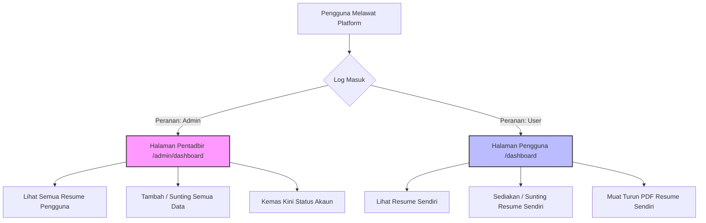

# DOKUMEN SPESIFIKASI PROJEK & PANDUAN PEMBANGUNAN
## APLIKASI WEB ATS RESUME BUILDER (MESRA ATS & HR)

---

### 1. PENGENALAN PROJEK
Sistem **Web-Based ATS Resume Builder** ialah platform pintar yang direka untuk membolehkan pengguna membina resume profesional yang dioptimumkan secara khusus bagi melepasi Sistem Penapisan Pemohon (**Applicant Tracking System - ATS**) yang digunakan oleh majikan global, di samping mengekalkan reka bentuk yang bersih dan mesra-bacaan bagi Pegawai Sumber Manusia (HR).

#### A. Senarai Teknologi Cadangan (Tech Stack)
Bagi memastikan aplikasi ini stabil, selamat, dan berskala besar, berikut adalah *tech stack* yang dicadangkan:
*   **Front-End (Antaramuka Pengguna):**
    *   **Framework:** React.js dengan Vite (untuk kelajuan build yang tinggi) atau Next.js (untuk kelebihan SSR/SEO).
    *   **Styling:** Vanilla CSS atau Tailwind CSS (dikonfigurasikan tanpa elemen visual kompleks seperti bayang-bayang tebal atau reka bentuk grid berlapis).
    *   **Penjanaan PDF (PDF Generation):** Menggunakan pustaka `@react-pdf/renderer` (Server-side/Client-side rendering) atau `html2pdf.js`. Pustaka ini wajib dikonfigurasikan untuk menjana fail PDF berasaskan teks sebenar (*selectable & searchable text*) dan bukannya imej raster (*flat image*) supaya bot parser ATS boleh mengekstrak teks dengan lancar.
*   **Back-End (Logik & API):**
    *   **Runtime Environment:** Node.js dengan framework Express.js atau Route API Next.js.
    *   **Validasi Data:** Zod atau Joi untuk menguatkuasakan validasi input pada tahap API (contoh: format No. Kad Pengenalan dan format E-mel).
    *   **Keselamatan & Autentikasi:** JSON Web Tokens (JWT) dengan penyimpanan cookie berciri `HttpOnly` untuk menghalang serangan XSS (*Cross-Site Scripting*).
*   **Pangkalan Data (Database):**
    *   **RDBMS:** PostgreSQL. Pemilihan pangkalan data hubungan ini memudahkan integriti data dan menyokong pengasingan data pengguna yang tersusun melalui kekunci asing (*foreign keys*).

---

### 2. SKEMA PANGKALAN DATA (DATABASE SCHEMA)
Struktur pangkalan data terdiri daripada dua jadual utama yang mengekalkan integriti data dan mengasingkan maklumat sensitif mengikut peranan pengguna.

#### Jadual A: `users`
Menyimpan maklumat akaun bagi pengguna biasa dan pentadbir (Admin).

| Nama Medan (Field) | Jenis Data (Data Type) | Sifat (Attributes) | Keterangan |
| :--- | :--- | :--- | :--- |
| `id` | UUID | PRIMARY KEY, DEFAULT gen_random_uuid() | ID unik pengguna/admin. |
| `username` | VARCHAR(50) | UNIQUE, NOT NULL | Nama pengguna untuk log masuk. |
| `email` | VARCHAR(100) | UNIQUE, NOT NULL | Alamat e-mel utama. |
| `password_hash` | VARCHAR(255) | NOT NULL | Kata laluan yang telah disulitkan (Bcrypt). |
| `role` | VARCHAR(10) | NOT NULL, DEFAULT 'user' | Peranan pengguna: `'user'` atau `'admin'`. |
| `created_at` | TIMESTAMP | DEFAULT CURRENT_TIMESTAMP | Tarikh pendaftaran akaun. |
| `updated_at` | TIMESTAMP | DEFAULT CURRENT_TIMESTAMP | Tarikh kemas kini akaun terbaharu. |

#### Jadual B: `resumes`
Menyimpan 10 maklumat wajib yang dioptimumkan untuk bacaan bot ATS.

| Nama Medan (Field) | Jenis Data (Data Type) | Sifat (Attributes) | Keterangan & Peraturan Validasi / Format |
| :--- | :--- | :--- | :--- |
| `id` | UUID | PRIMARY KEY, DEFAULT gen_random_uuid() | ID unik resume. |
| `user_id` | UUID | FOREIGN KEY -> `users(id)`, ON DELETE CASCADE | Pemilik data resume (Menjamin pengasingan data). |
| `nama_penuh` | VARCHAR(150) | NOT NULL | **[1] Nama:** Nama penuh pengguna seperti dalam dokumen rasmi. |
| `alamat` | TEXT | NOT NULL | **[2] Alamat:** Alamat kediaman terkini secara terperinci. |
| `no_ic` | VARCHAR(14) | NOT NULL | **[3] IC Number:** Validasi regex: `^\d{6}-\d{2}-\d{4}$` (Cth: `123456-12-1234`). |
| `email` | VARCHAR(100) | NOT NULL | **[4] EMail:** E-mel profesional (Validasi format e-mel standard). |
| `no_telefon` | VARCHAR(20) | NOT NULL | **[5] No. Telefon:** Nombor telefon yang boleh dihubungi. |
| `pendidikan` | JSONB | NOT NULL | **[6] Sekolah:** Senarai latar belakang pendidikan (Nama Institusi, Bidang Pengajian, Tahun Mula, Tahun Tamat). |
| `pengalaman_kerja`| JSONB | NOT NULL | **[7] Pengalaman Kerja:** Disimpan dan dipaparkan dalam format kronologi terbalik: `<Dari Tahun sehingga> - <Lokasi bekerja> - <Jawatan>`. |
| `sijil` | JSONB | NULL | **[8] Sijil:** Senarai sijil profesional, teknikal, atau akademik untuk padanan kata kunci. |
| `ulasan` | TEXT | NOT NULL | **[9] Ulasan:** Ringkasan profesional (*Professional Summary*) yang padat dengan pencapaian. |
| `lain_lain` | JSONB | NULL | **[10] Lain-lain:** Kemahiran (*Hard/Soft Skills*), bahasa, portfolio, dan kata kunci industri. |
| `created_at` | TIMESTAMP | DEFAULT CURRENT_TIMESTAMP | Tarikh resume dicipta. |
| `updated_at` | TIMESTAMP | DEFAULT CURRENT_TIMESTAMP | Tarikh resume dikemas kini. |

---

### 3. ALIRAN KERJA (WORKFLOW) & KAWALAN AKSES (ACCESS CONTROL)
Aplikasi menguatkuasakan pengasingan kuasa yang ketat di antara Portal Pentadbir (Admin) dan Portal Pengguna biasa (User).



#### A. Portal Pengguna (User Portal)
*   **Log Masuk Biasa:** Pengguna biasa mendaftar dan log masuk ke dashboard pengguna di laluan `/dashboard`.
*   **Pengasingan Data:** Setiap query pangkalan data ditapis menggunakan ID pengguna yang sedang aktif (`WHERE user_id = current_user_id`). Ini menghalang capaian haram ke atas resume milik orang lain.
*   **Kuasa Tindakan:** Pengguna hanya mempunyai hak CRUD ke atas rekod resume mereka sendiri. Mereka dibenarkan membina, mengedit, memapar, dan mengeksport PDF resume sendiri sahaja.

#### B. Portal Pentadbir (Admin Portal)
*   **Halaman Log Masuk Berasingan:** Laluan URL pentadbir diletakkan pada domain/laluan berbeza yang selamat (contohnya: `/admin/login` atau panel kawalan yang berasingan).
*   **Peranan & Middleware:** Pengesahan sesi admin disaring menggunakan middleware pada backend untuk memastikan nilai medan `role` adalah `'admin'`.
*   **Kuasa Akses Penuh:** Pentadbir diberikan hak akses penuh untuk memantau pangkalan data secara meluas. Admin boleh:
    *   Mencari dan memapar semua resume pengguna berdaftar.
    *   Menambah profil pengguna baharu secara manual.
    *   Menyunting atau mengemas kini keseluruhan maklumat daripada 10 medan data resume bagi mana-mana pengguna untuk tujuan pembetulan atau penyuntingan rasmi.

---

### 4. CIRI-CIRI PENINGKATAN KERJAYA (ATS BOOSTER)
Sistem Penapisan Pemohon (ATS) menggunakan parser teks automatik untuk menapis resume sebelum ia sampai ke tangan HR. Berikut ialah senarai garis panduan pengoptimuman yang wajib dibina ke dalam sistem penjanaan fail oleh pembangun:

#### A. Logik Bebas Elemen Grafik Berat
Bagi memastikan output PDF tidak mempunyai elemen visual berat yang merosakkan algoritma bacaan ATS, sistem mesti melaksanakan peraturan reka bentuk berikut:
1.  **Format PDF Berasaskan Teks (Searchable/Selectable PDF):**
    Sistem dilarang menukar resume kepada format imej (seperti JPEG/PNG) sebelum dimasukkan ke dalam fail PDF. Fail output mestilah fail PDF vektor tulen di mana setiap baris teks boleh dipilih dan disalin.
2.  **Sifar Komponen Visual Kompleks:**
    Sistem perlu mengecualikan elemen seperti:
    *   *Skill Progress Bars* (Bar peratusan kemahiran) yang tidak dapat dibaca oleh bot.
    *   Ikon grafik yang menggantikan teks (cth. ikon telefon menggantikan perkataan "No. Telefon"). Perkataan bertulis perlu disertakan di sebelah ikon jika ikon digunakan.
    *   Carta bulat (Pie Charts) atau graf prestasi.
3.  **Tata Rajah Lajur Tunggal (Single-Column Layout):**
    Susun atur lajur berkembar (*two-column layout*) sering menyebabkan parser ATS membaca dari kiri ke kanan merentasi lajur, mewujudkan ayat yang tidak logik. Reka bentuk output resume dicadangkan menggunakan reka letak lajur tunggal yang mengalir secara menegak dari atas ke bawah.
4.  **Tiada Jadual Kompleks (No Nested Tables):**
    Jadual bertindih (*nested tables*) atau jadual dengan sempadan tidak sekata sering menyebabkan data hilang semasa parsing. Borang output resume dibina dengan menggunakan tag perenggan (`<p>`) atau senarai (`<ul>`/`<li>`) dan bukannya kotak jadual untuk memaparkan maklumat.

#### B. Tipografi & Garis Panduan Format Teks
*   **Font Piawai (Standard Fonts Only):** Sistem mengehadkan pilihan font kepada fon mesra ATS yang sedia ada dalam sistem operasi utama seperti *Arial, Calibri, Times New Roman, Georgia,* atau *Helvetica*. Pilihan font hiasan (*decorative*) hendaklah disekat.
*   **Saiz Fon yang Seimbang:** Saiz font tajuk (H1/H2) dihadkan antara 14pt - 16pt, manakala teks badan (*body text*) dihadkan antara 10pt - 12pt.
*   **Margin Halaman Konsisten:** Output PDF ditetapkan secara automatik dengan margin standard 1 inci (atau minimum 0.5 inci) di semua sudut bagi mengekalkan struktur cetakan.
*   **Keseragaman Format Tarikh:**
    Pembangun perlu menguatkuasakan tarikh input dalam borang menggunakan pemilih tarikh (*date picker*) dan menukarnya kepada format standard yang seragam pada output (contoh: `MM/YYYY` atau `Month YYYY` seperti `06/2021` atau `Jun 2021`).
*   **Format Kronologi Terbalik yang Tegas:**
    Sistem memaparkan pengalaman kerja mengikut urutan kronologi terbalik secara automatik berasaskan tarikh tamat kerja. Pengalaman kerja terkini wajib berada di bahagian atas sekali.
    *   **Format Output Wajib:** `[Tahun Mula] - [Tahun Tamat/Kini] | [Nama Syarikat, Lokasi] | [Jawatan]`

---

### 5. INTEGRASI GITHUB & PANDUAN REPOSITORI
Berikut adalah panduan langkah demi langkah untuk pembangun memulakan, merekodkan perubahan, dan menolak (*push*) projek ini ke dalam repositori GitHub yang baharu.

#### A. Arahan Terminal / Git CLI

```bash
# 1. Masuk ke dalam direktori projek
cd path/to/your/workspace/resume

# 2. Mulakan repositori Git baharu secara lokal
git init

# 3. Buat fail .gitignore untuk mengabaikan fail yang tidak perlu dimasukkan ke GitHub
# (Cth: fail konfigurasi peribadi, kunci API, node_modules)
echo "node_modules/
.env
.env.local
dist/
build/
.DS_Store" > .gitignore

# 4. Semak status fail yang dikesan oleh Git
git status

# 5. Tambah semua fail spesifikasi dan fail kod ke staging area
git add .

# 6. Lakukan commit pertama projek dengan mesej yang jelas
git commit -m "feat: inisialisasi projek ATS Resume Builder dan spesifikasi database"

# 7. Tetapkan nama cawangan utama (branch) sebagai 'main'
git branch -M main

# 8. Pautkan repositori lokal ke repositori GitHub anda
# (Gantikan URL di bawah dengan URL repositori GitHub anda yang sebenar)
git remote add origin https://github.com/username/ats-resume-builder.git

# 9. Tolak kod lokal ke repositori GitHub dalam branch main
git push -u origin main
```

#### B. Amalan Terbaik Mesej Commit (Git Commit Best Practices)
Pembangun sangat digalakkan menggunakan konvensyen *Semantic Commits* untuk memudahkan pengesanan sejarah kod:
*   `feat:` untuk fungsi atau ciri baharu (contoh: `feat: tambah validasi regex no ic`).
*   `fix:` untuk membetulkan pepijat (contoh: `fix: betulkan reka letak lajur pdf`).
*   `docs:` untuk penambahan atau kemas kini dokumentasi (contoh: `docs: kemas kini spesifikasi sistem`).
*   `style:` untuk perubahan kosmetik/gaya kod tanpa melibatkan logik perisian.
